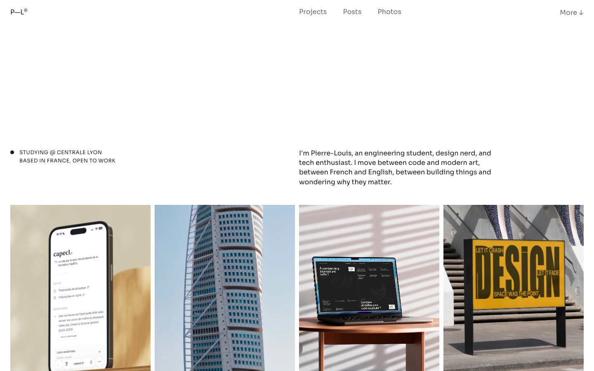

# pierrelouis.net

Personal site: static HTML, CSS, and vanilla JavaScript, with a small Node.js build and two PHP endpoints.

[Live site](https://pierrelouis.net)



## Stack

- **Pages:** one HTML document per route (`about/index.html`, …), shared `base.css` / `script.js` / `footer.js`, page-level CSS and JS
- **Build:** Node.js ES modules, Eleventy + markdown-it (posts), KaTeX, Highlight.js
- **Images:** ImageMagick → WebP
- **Server:** PHP proxies for Last.fm and weather (Hostinger)

## Development

Requires Node.js and ImageMagick (`magick`) for image rebuilds.

```bash
npm install
npm run dev      # build, serve on :8000 (PORT to override), watch, live reload
```

| Command | Purpose |
| --- | --- |
| `npm run build` | Full build into `dist/` |
| `npm run build:deploy` | Assemble `dist/` only, skipping source builds |
| `npm run build:posts` | Compile posts from `content/posts/` |
| `npm run build:lists` | Sync Obsidian lists and build the Lists page |
| `npm run preview` | Serve `dist/` on port 4173 |
| `npm test` | Run the test suite |
| `npm run qa:posts` | Browser-test every post at desktop and mobile sizes |

## Build

`scripts/build-site.mjs` runs, in order:

1. **Lists:** sync Obsidian `Portfolio/Lists`, compile sheets from `lists/sheets/`
2. **Projects:** `content/projects/` → resized WebP in `assets/projects/` + project listing
3. **Photos:** `content/photos/` → thumbnails (1040 px) in `assets/photos/`, full-size (2560 px) in `assets/photos-full/`
4. **Links:** build the Links carousel
5. **Posts:** import Obsidian posts into `content/posts/`, compile with Eleventy
6. **Shared components:** write header and footer into every page
7. **Assemble:** copy public files into `dist/` and hash CSS/JS

Image builds are cached by source signature. Unchanged images are skipped and stale outputs are pruned. Generated HTML and assets are committed.

## API endpoints

`dist/` is deployed to Hostinger `public_html`, where `/api/*.php` runs as PHP (cURL required). The dev server emulates both endpoints in Node.

- **`/api/lastfm.php`** keeps the API key server-side. Production config lives in `private/lastfm.php`, outside `public_html`. Locally, set `LASTFM_API_KEY` (and optionally `LASTFM_USER`) in the env, `.env`, or `.env.local`. 15 s cache, 6 h stale fallback.
- **`/api/weather.php`** proxies Open-Meteo so visitor IPs aren't exposed. 15 min cache, 3 h stale fallback. Needs a writable PHP temp dir. Display logic stays in `footer.js`.

## Editing content

| What | Where | Docs |
| --- | --- | --- |
| Header / footer | `scripts/shared-components.mjs` (generated copies get overwritten) | |
| Projects | `content/projects/`, page settings in `scripts/build-projects.mjs` | [README](./content/projects/README.md) |
| Photos | `content/photos/`, page settings in `scripts/build-photos.mjs` | [README](./content/photos/README.md) |
| Posts | Obsidian vault | [README](./content/posts/README.md) |
| Lists | Obsidian `Portfolio/Lists/` + `lists/sheets/` | [README](./lists/sheets/README.md) |

The root `.htaccess` sets media MIME types Hostinger misses (e.g. `video/webm`). It must stay in `PUBLIC_ROOT_FILES`.

## License

Code is [MIT](./LICENSE). The design, writing, photography, and other personal or third-party media are not covered.
