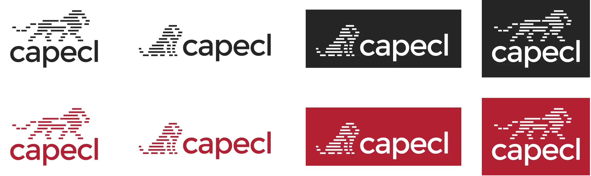
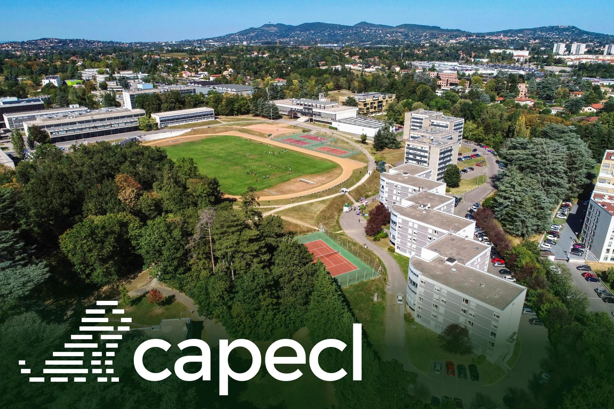
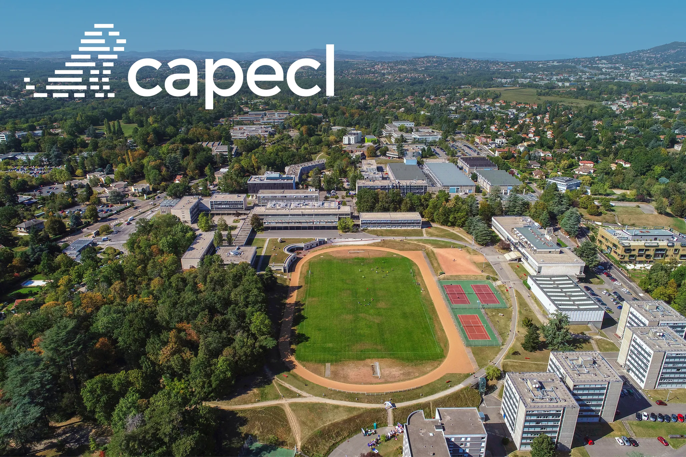
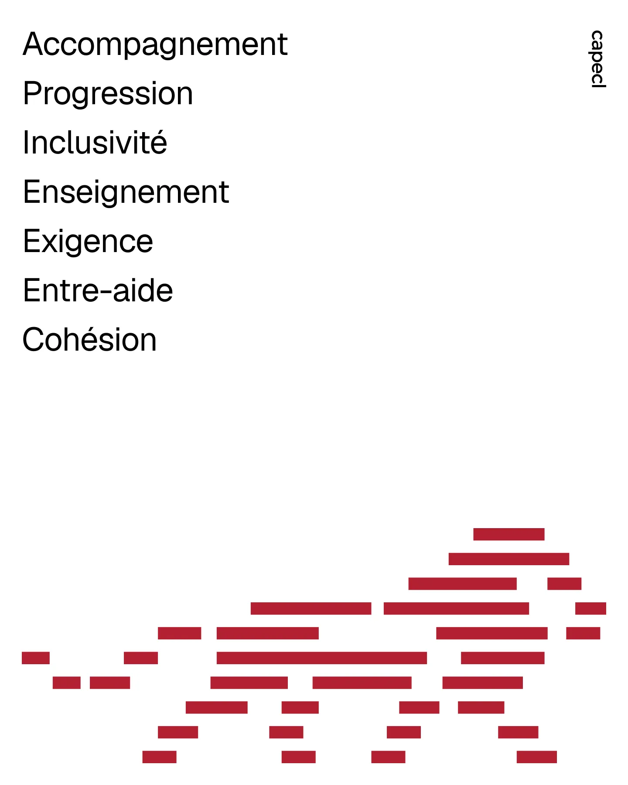
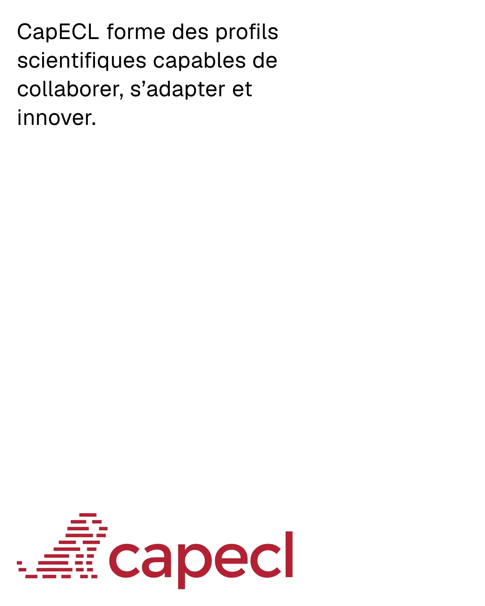
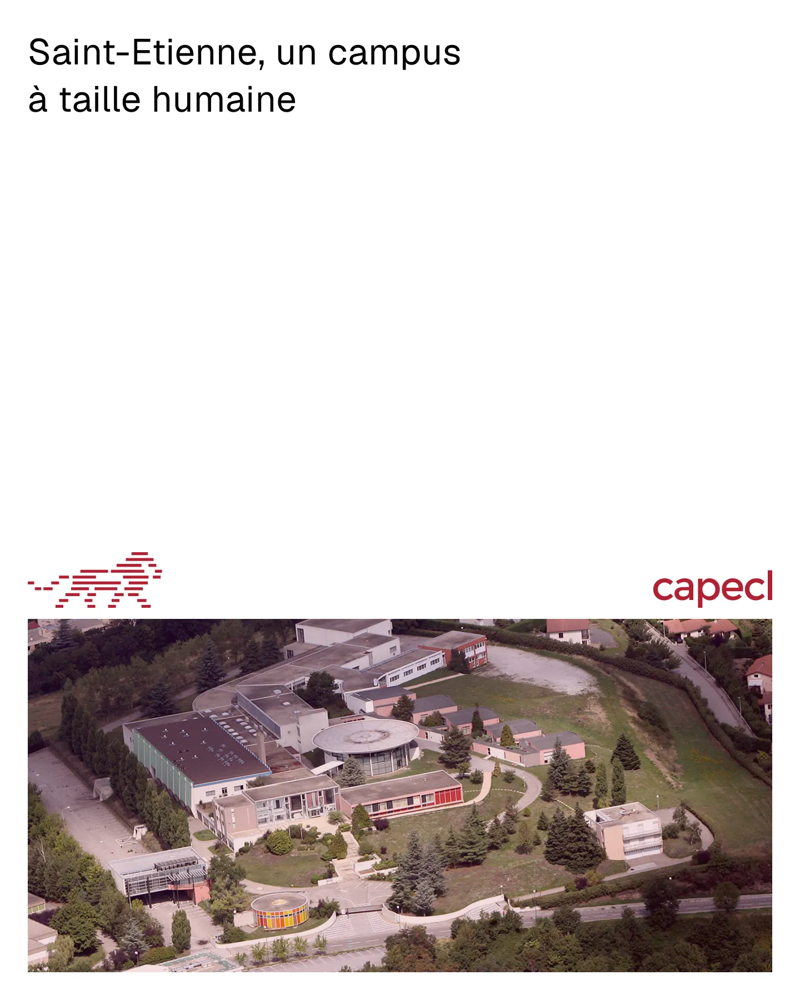
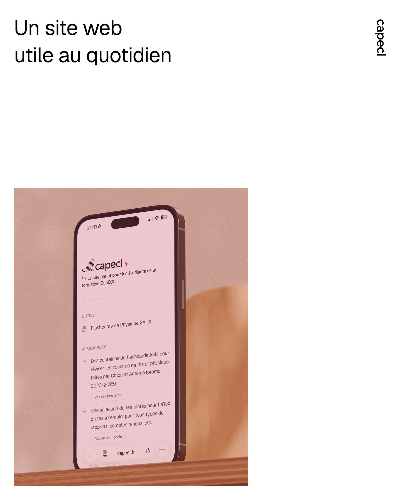
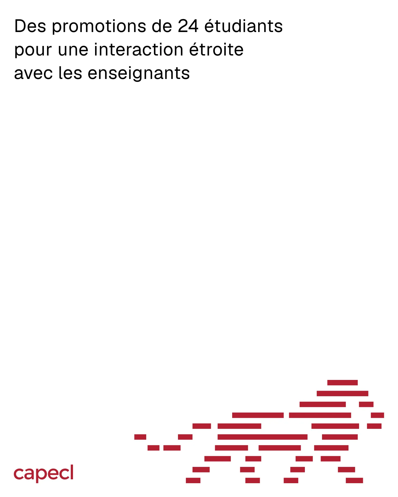
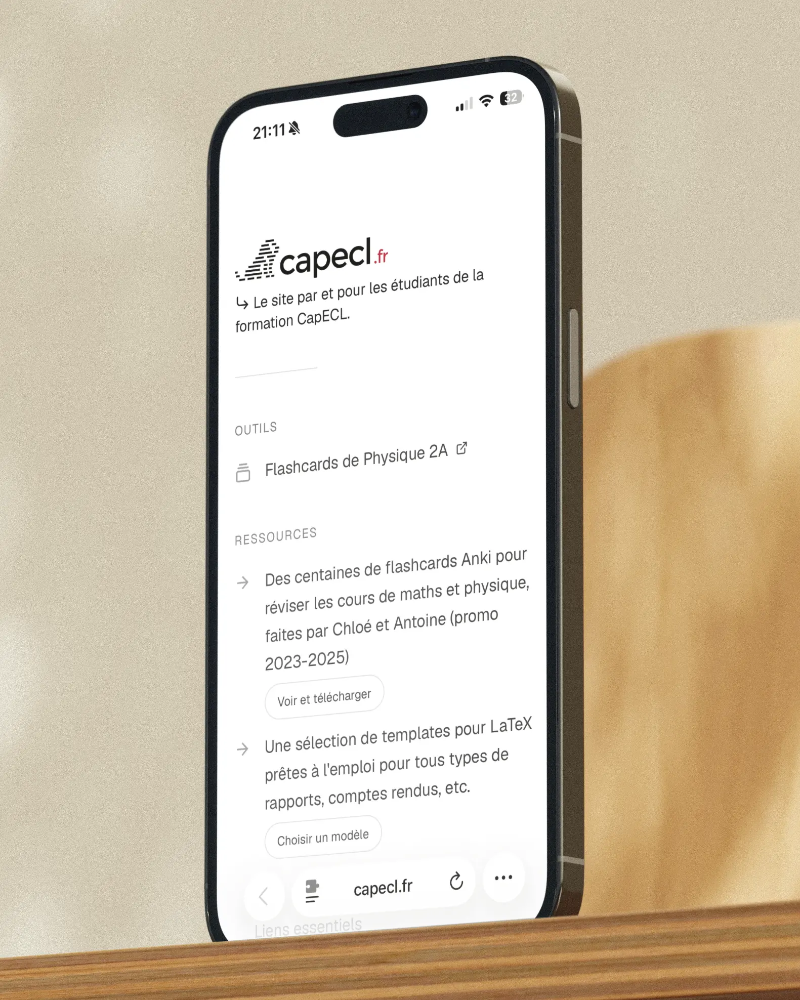
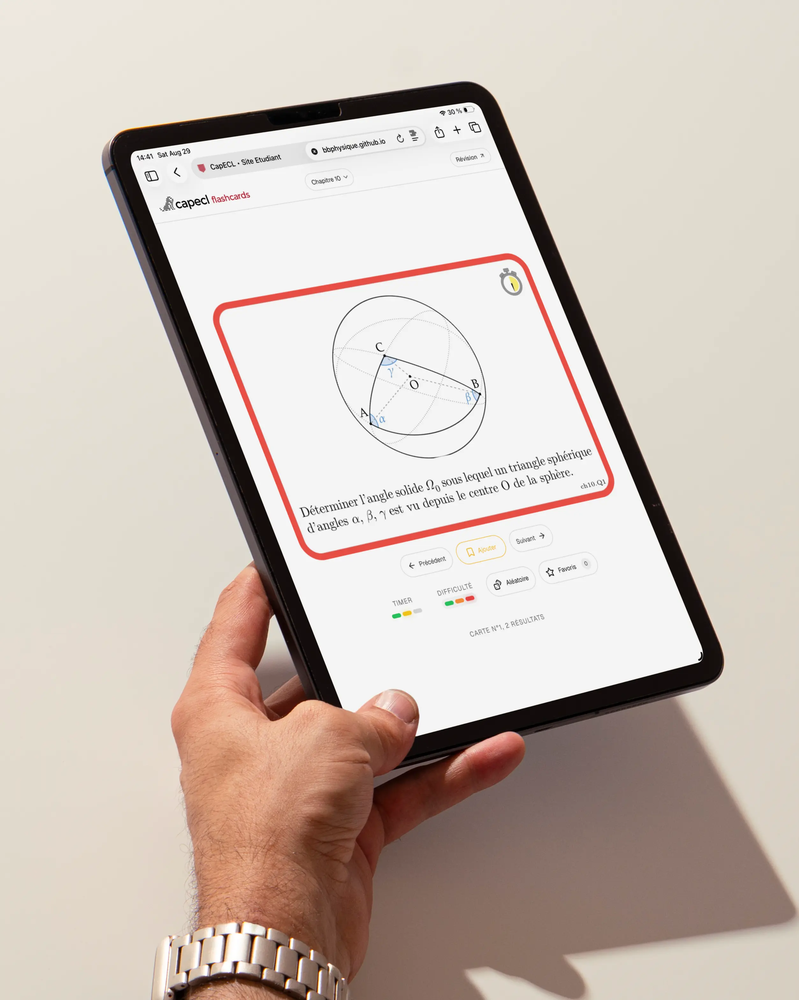

{wide}

## A shared identity

CapECL was still a young programme, but it already had a clear character: demanding, close-knit and built around progress. I wanted the identity to make that balance visible. It needed to be serious enough for an engineering course, but warmer and more direct than a typical institutional brand.

{contained}

The lion logomark is built from short horizontal lines. In fact, two logomarks were made here. One walking lion and one sitting lion. This way, the logo is polyvalent and can be used in a stacked or horizontal layout. It can work as a compact symbol or a full wordmark, while the red, black and white palette keeps every version direct and recognisable.

{carousel}
{carousel}

## A campaign made from real details

The poster series turns the identity into short, straightforward statements. Instead of trying to explain the whole programme at once, each poster focuses on something concrete: the values, the Saint-Étienne campus, the 24-student cohort or the student website itself.

{carousel-contained}
{carousel-contained}
{carousel-contained}
{carousel-contained}
{carousel-contained}

## From identity to a useful website

The same system carries into [capecl.fr](https://capecl.fr/). I am a former CapECL student myself, so “made by and for CapECL students” is quite literal: I designed and built the site from the perspective of someone who went through the programme. It brings physics flashcards, LaTeX templates and frequently used school links into one place, with a simple interface designed to be useful between classes rather than feel like another school portal.

The physics flashcards are a collaboration with my physics teacher. I designed and built the web experience, while he created both the content and the visual design of the cards themselves. They are not meant to teach physics from scratch or serve a general audience; they are made to help CapECL students revise the second-year physics course, with particular attention to its trickier and easily missed points. The dedicated flashcard site is available [here](https://capecl.fr/cartes/).

I designed the identity, poster system and website as parts of the same project. The result is a small brand that can introduce the programme from the outside and still remain genuinely useful to the students living with it every day.
