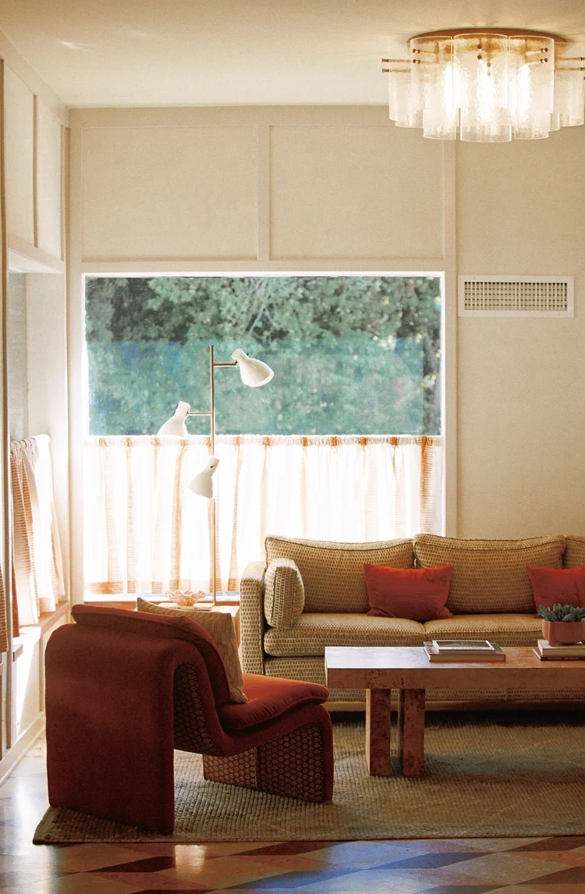
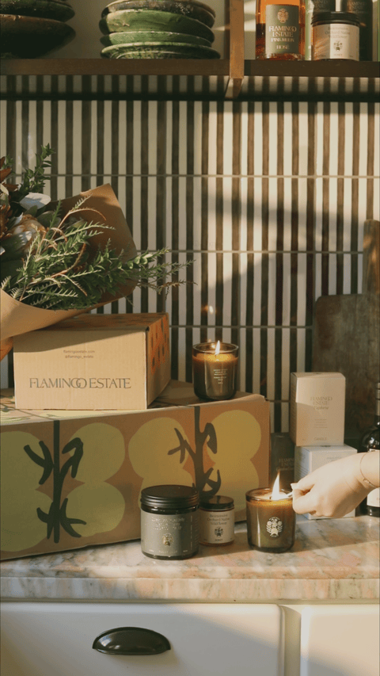
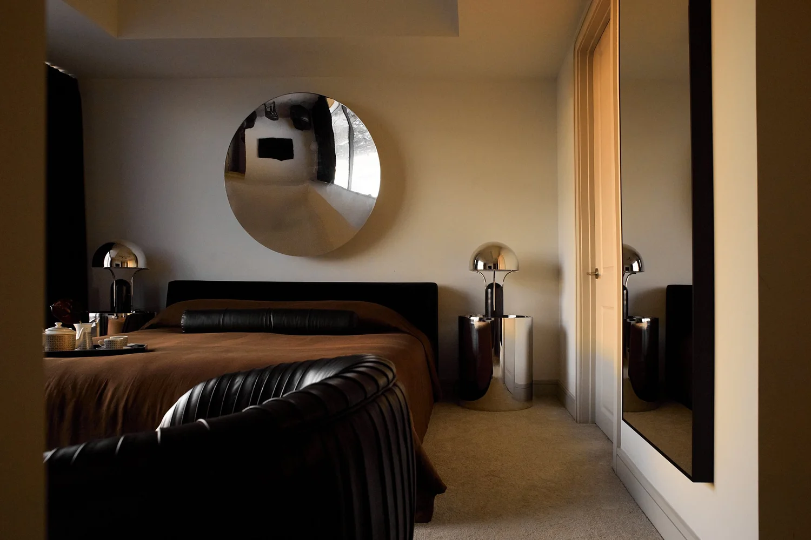

{wide}

The study follows small domestic rituals and lets material, light and movement carry the identity.

## Approach

Still and moving images use the same warm palette and unhurried rhythm, so the campaign can shift format without losing its atmosphere.
