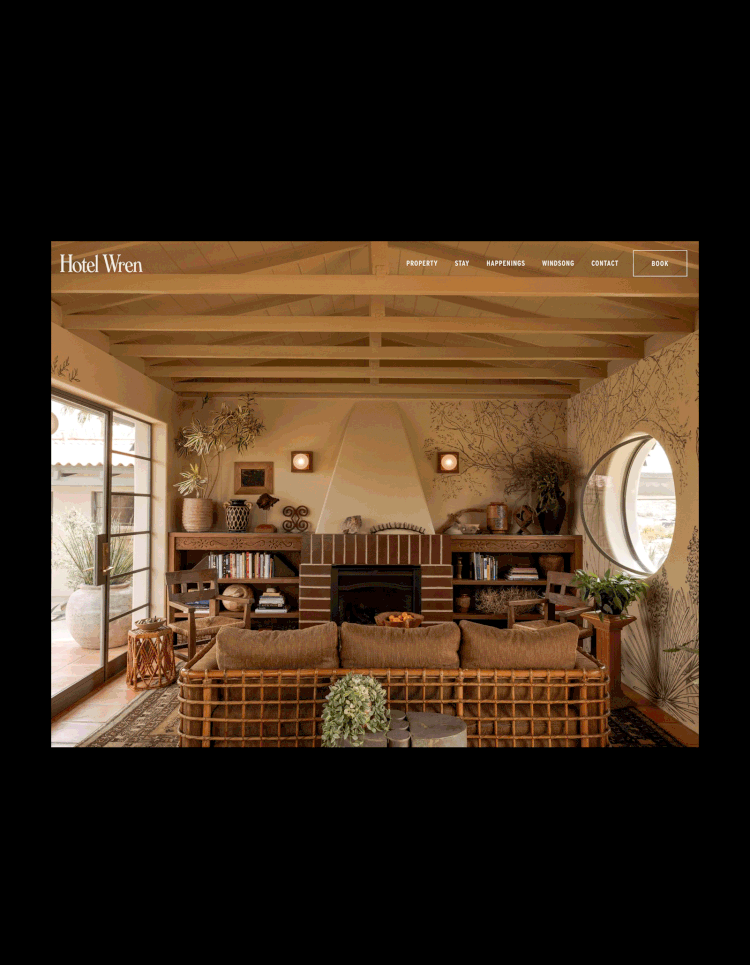
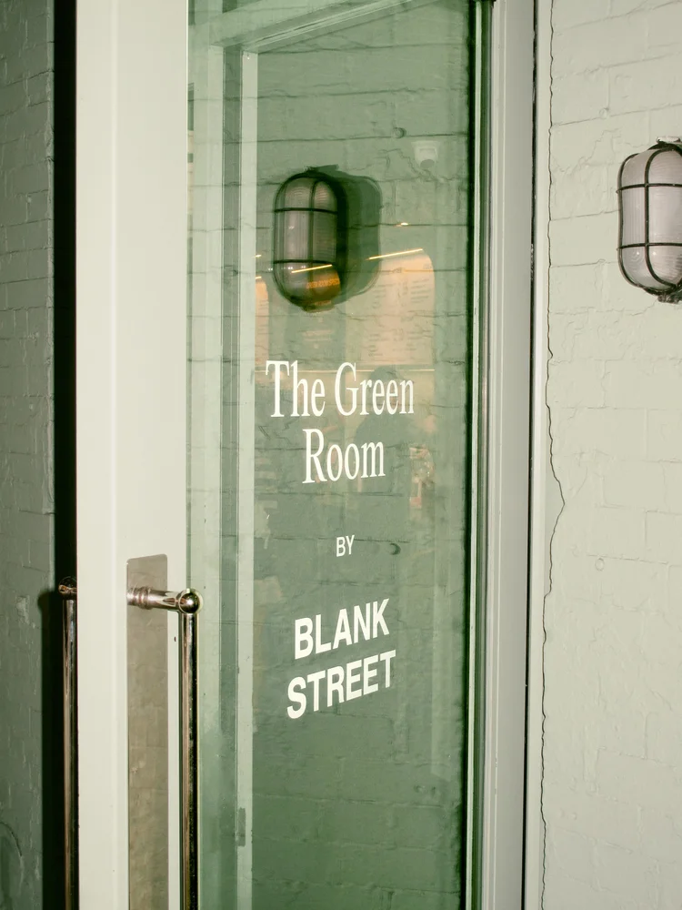

{wide}

Hotel Wren's digital experience was designed to feel as measured and welcoming as the place itself.

## A quieter interface

The system gives photography room to lead while navigation and motion remain calm, clear and deliberate.
