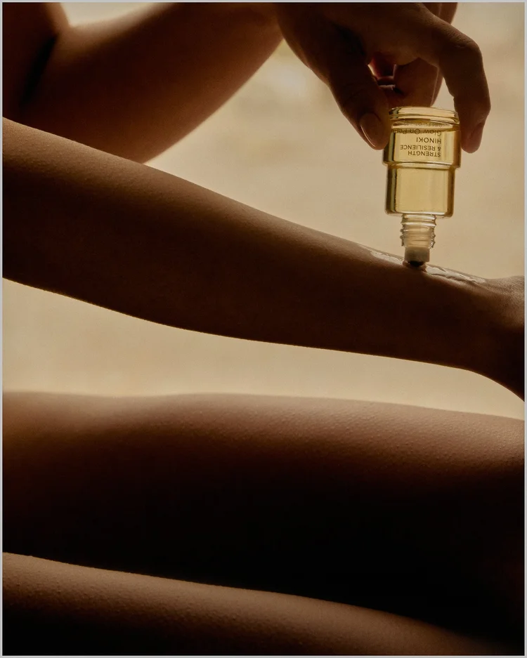
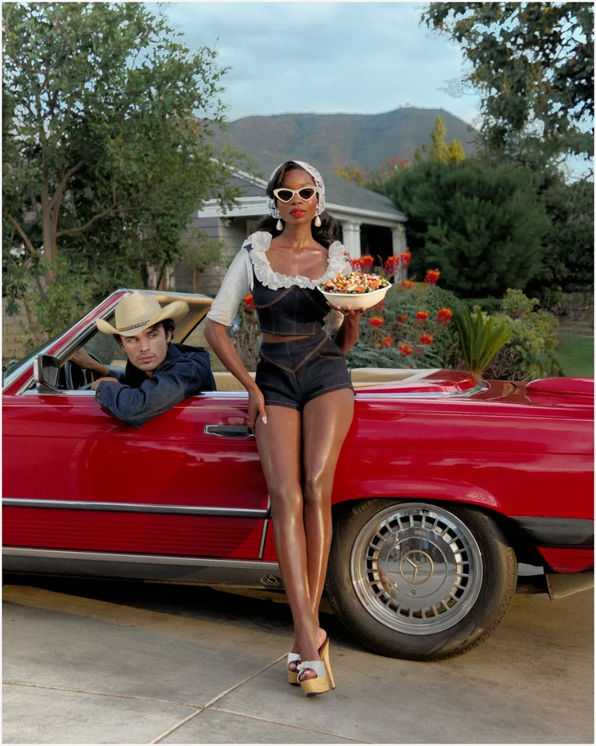
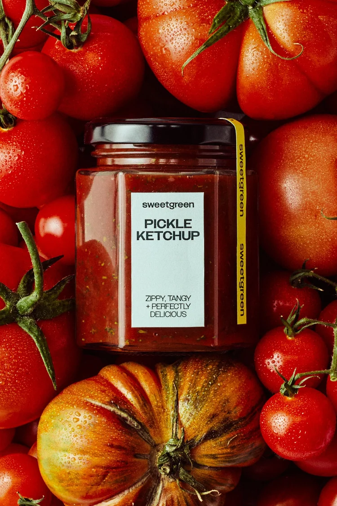

{wide}

The project started with the idea of creating a cinematic world without losing Sweetgreen's playful and immediate character.

{wide}

## Building the visual language

Portraits, food photography and product details were treated as parts of the same visual system.
