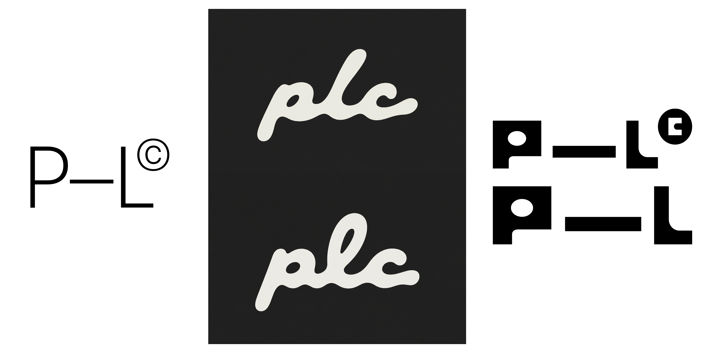
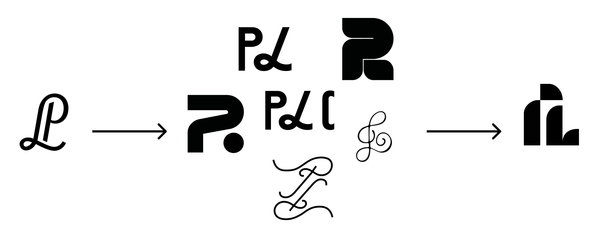

My name is used throughout this website under two different ways: my entire first name and my initials.

Finally, I needed an very simple icon/logo, mainly used as a favicon. Here is the process I followed to create it:

On the left is the original logo I used with my old portfolio. It was heavily inspired by something I saw on Pinterest. Then I gathered more inspiration. It needed to be simple, easy to see when small and kinda modern and minimalistic. This is how I ended up, as you can see on the right.
